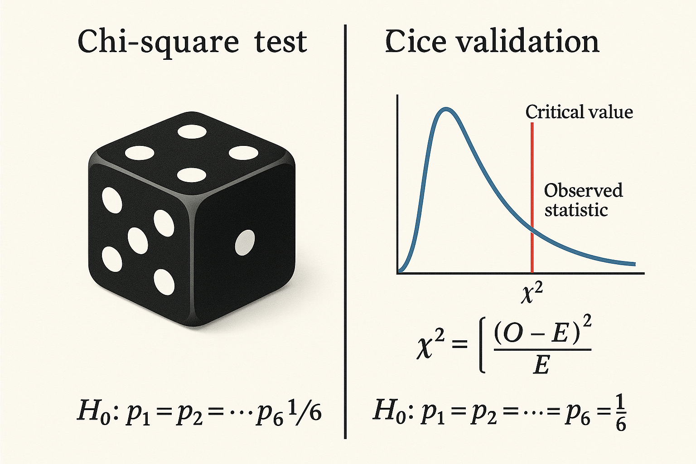
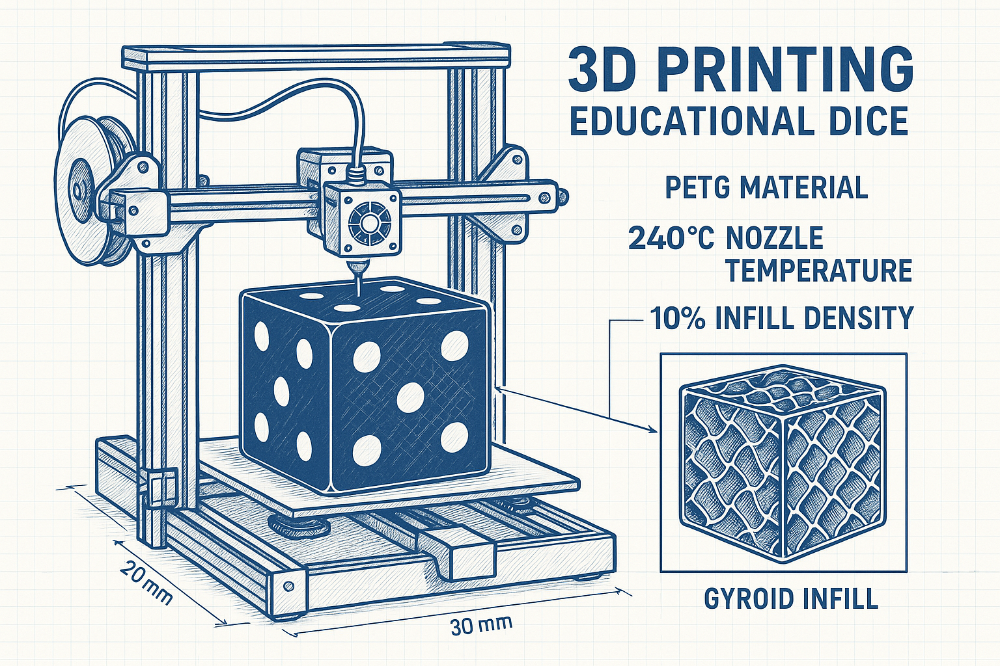

# 🎲 Projeto: Validação Estatística de Dado Cúbico Impresso em 3D


## 📋 Sobre o Projeto

Este projeto educacional demonstra a fabricação e validação estatística de um dado cúbico de 150mm³ usando impressão 3D com filamento PETG. O objetivo é criar uma ferramenta didática para ensinar conceitos de probabilidade e inferência estatística, validando cientificamente a aleatoriedade do dado através do teste qui-quadrado.

**Desenvolvido por:** Diogo Da Silva Rego - Estudante de Estatística  
**Projeto Educacional:** [@estatisticacomjogos](https://www.instagram.com/estatisticacomjogos/)  
**Repositório:** [projetos_educacionais](https://github.com/Diogorego20/projetos_educacionais.git)

## 🎯 Objetivos

- **Educacional:** Demonstrar conceitos de probabilidade e estatística através de um objeto físico
- **Técnico:** Validar a aleatoriedade de dados impressos em 3D usando métodos estatísticos rigorosos
- **Científico:** Aplicar o teste qui-quadrado para inferência sobre equiprobabilidade das faces

## 🔬 Metodologia Científica

### Fabricação do Dado

- **Material:** PETG (Polietileno Tereftalato Glicol)
- **Dimensões:** 150mm × 150mm × 150mm
- **Preenchimento:** 10% com padrão Gyroid
- **Temperatura de impressão:** 240°C (bico) / 80°C (mesa)
- **Bordas:** Arredondadas para reduzir desgaste

### Validação Estatística

- **Método:** Teste Qui-Quadrado de Qualidade do Ajuste
- **Hipóteses:**
  - H₀: p₁ = p₂ = p₃ = p₄ = p₅ = p₆ = 1/6 (dado justo)
  - H₁: Pelo menos uma probabilidade ≠ 1/6 (dado viciado)
- **Critério:** α = 0.05, χ²crítico = 11.0705 (5 g.l.)
- **Amostra recomendada:** ≥ 600 lançamentos

## 📊 Resultados Principais

### Teste de Validação

```
Número de lançamentos: 600
Estatística χ²: 1.3600
P-valor: 0.928638
Decisão: ✅ Dado aprovado (não há evidência de vício)
```

### Distribuição de Frequências

| Face | Observado | Esperado | Diferença | Contribuição χ² |
|------|-----------|----------|-----------|-----------------|
| 1    | 106       | 100      | +6        | 0.36           |
| 2    | 102       | 100      | +2        | 0.04           |
| 3    | 96        | 100      | -4        | 0.16           |
| 4    | 92        | 100      | -8        | 0.64           |
| 5    | 100       | 100      | 0         | 0.00           |
| 6    | 104       | 100      | +4        | 0.16           |

## 🗂️ Estrutura do Projeto

```
projeto_dado_educacional/
├── README.md                    # Este arquivo
├── docs/                        # Documentação técnica
│   ├── analise_tecnica_dado.md  # Análise das imagens 3D
│   └── pesquisa_cientifica.md   # Fundamentação científica
├── src/                         # Código fonte
│   └── simulacao_dado_simples.R # Script R para validação
├── images/                      # Imagens e diagramas
│   ├── diagrama_processo_validacao.png
│   ├── diagrama_estrutura_interna.png
│   ├── ilustracao_teste_chi2.png
│   ├── ilustracao_impressao_3d.png
│   ├── grafico_frequencias_base.png
│   └── grafico_multiplos_dados.png
├── results/                     # Resultados das análises
│   ├── resultados_frequencias.csv
│   ├── resultados_sensibilidade.csv
│   └── resultados_multiplos_dados.csv
└── data/                        # Dados experimentais
```

## 🚀 Como Usar

### Pré-requisitos

- R (versão ≥ 4.0)
- Impressora 3D compatível com PETG
- Conhecimentos básicos de estatística

### Executando a Simulação

```bash
# Clone o repositório
git clone https://github.com/Diogorego20/projetos_educacionais.git

# Navegue para o projeto
cd projetos_educacionais/projeto_dado_educacional

# Execute a simulação em R
Rscript src/simulacao_dado_simples.R
```

### Interpretando os Resultados

1. **P-valor > 0.05:** Dado aprovado (não há evidência de vício)
2. **P-valor ≤ 0.05:** Dado reprovado (evidência de vício)
3. **Contribuições χ²:** Faces com valores altos podem indicar tendências

## 📈 Visualizações

### Processo de Validação


### Estrutura Interna


### Teste Qui-Quadrado


### Impressão 3D


## 🔬 Fundamentação Científica

### Propriedades do PETG

- **Resistência à tração:** 50-53 MPa
- **Módulo de elasticidade:** 14.53-19.06 GPa
- **Temperatura de transição vítrea:** ~80°C
- **Vantagens:** Alta durabilidade, resistência química, facilidade de impressão

### Padrão Gyroid

- **Características:** Superfície mínima triperiódica
- **Vantagens:** Distribuição uniforme de massa, resistência multidirecional
- **Aplicação:** Garante centro de massa coincidente com centro geométrico

### Teste Qui-Quadrado

- **Estatística:** χ² = Σ[(Observado - Esperado)²/Esperado]
- **Distribuição:** χ² ~ χ²(5) sob H₀
- **Poder:** Aumenta com o tamanho da amostra
- **Limitações:** Requer frequências esperadas ≥ 5

## 📚 Aplicações Educacionais

### Em Sala de Aula

1. **Conceitos de Probabilidade**
   - Equiprobabilidade
   - Lei dos Grandes Números
   - Convergência de frequências

2. **Inferência Estatística**
   - Teste de hipóteses
   - Distribuição qui-quadrado
   - P-valor e significância

3. **Tecnologia e Matemática**
   - Impressão 3D
   - Modelagem geométrica
   - Análise de dados

### Atividades Sugeridas

- **Coleta de dados:** Estudantes realizam lançamentos e registram resultados
- **Análise estatística:** Aplicação do teste qui-quadrado aos dados coletados
- **Comparação:** Diferentes métodos de lançamento (manual vs. automatizado)
- **Discussão:** Interpretação dos resultados e implicações práticas

## 🤝 Contribuições

Contribuições são bem-vindas! Por favor:

1. Faça um fork do projeto
2. Crie uma branch para sua feature (`git checkout -b feature/AmazingFeature`)
3. Commit suas mudanças (`git commit -m 'Add some AmazingFeature'`)
4. Push para a branch (`git push origin feature/AmazingFeature`)
5. Abra um Pull Request

## 📄 Licença

Este projeto está sob a licença MIT. Veja o arquivo `LICENSE` para mais detalhes.

## 📞 Contato

**Diogo Da Silva Rego**
- Instagram: [@estatisticacomjogos](https://www.instagram.com/estatisticacomjogos/)
- GitHub: [Diogorego20](https://github.com/Diogorego20)
- Projeto: [projetos_educacionais](https://github.com/Diogorego20/projetos_educacionais.git)

## 🙏 Agradecimentos

- Comunidade de impressão 3D pela doação do material
- Professores e estudantes que contribuíram com feedback
- Projeto educacional "Estatística com Jogos"

---

**⭐ Se este projeto foi útil para você, considere dar uma estrela no repositório!**

